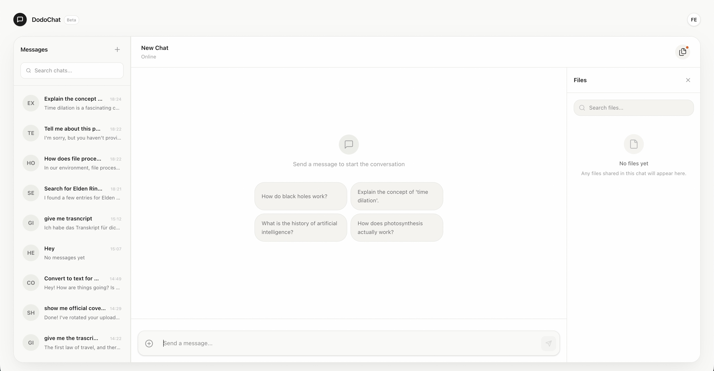

# DodoChat

DodoChat is my playground for exploring LLM runtimes, streaming interactions, and complex tool-calling patterns. I started this project because I wanted to understand what it actually feels like to build a real application around large language models—beyond just standard chat prompts.

It's not a polished SaaS product. It's an ongoing experiment where I test ideas, break things, and see how far I can push current AI models in a production-like environment.



## The Focus

The project is primarily about the details that make AI feel less like a black box and more like a tool:
- **Fast Streaming**: Token-by-token responses for a responsive feel.
- **Tool Intelligence**: Giving the model the ability to "do things" (process files, search databases, transform images).
- **Persistent Context**: Maintaining a clean, indexed conversation history.

## What's Inside

- **Document Intelligence & RAG**: Uses vector embeddings to index and search uploaded documents, providing the model with accurate local context.
- **File Generation**: The AI can generate `.txt` and `.pdf` files on the fly based on your conversation.
- **Image & Media Reasoning**: Handles multi-modal inputs natively. It can search IGDB for gaming data or use `sharp` to apply transformations to images.
- **Gaming Integration**: Supports integration with the IGDB database for reasoning about games, screenshots, and release history.

## The Stack

- **Runtime**: Bun + Node.js
- **Intelligence**: Google Gemini (Flash, Text-Embedding-001)
- **Orchestra**: Vercel AI SDK
- **Frontend**: React, Vite, TanStack Router, Tailwind CSS
- **Processing**: Sharp (Images), MongoDB (Database)

## Getting Started

You'll need [Bun](https://bun.sh) installed.

### 1. Clone & Install

```bash
git clone https://github.com/echoeyecodes/dodochat.git
cd dodochat
bun install
```

### 2. Environment Setup

Go into the `server` directory and set up your `.env`:

```bash
cd server
cp .env.sample .env
```

You'll need a few keys:
- `GOOGLE_GENERATIVE_AI_API_KEY`: Get one from Google AI Studio.
- `MONGODB_URI`: Your Mongo connection string.
- `IGDB_CLIENT_ID` & `IGDB_CLIENT_SECRET`: For gaming data features.
- See `.env.sample` for the full list (Firebase, Storage, etc.).

### 3. Run it

From the root directory:

```bash
# Run both web and server concurrently
bun run dev
```

Or run them separately:
- `bun run dev:web`
- `bun run dev:srv`

## License

## Contributing

You're welcome to poke around the architecture, see how the tool calling is implemented, or use parts of it for your own experiments!
